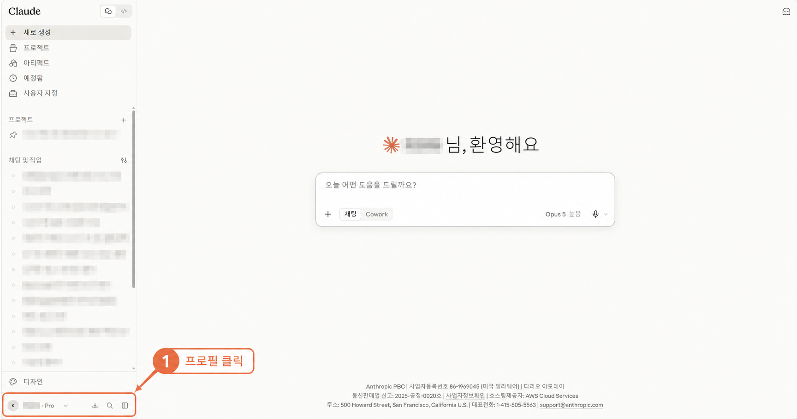
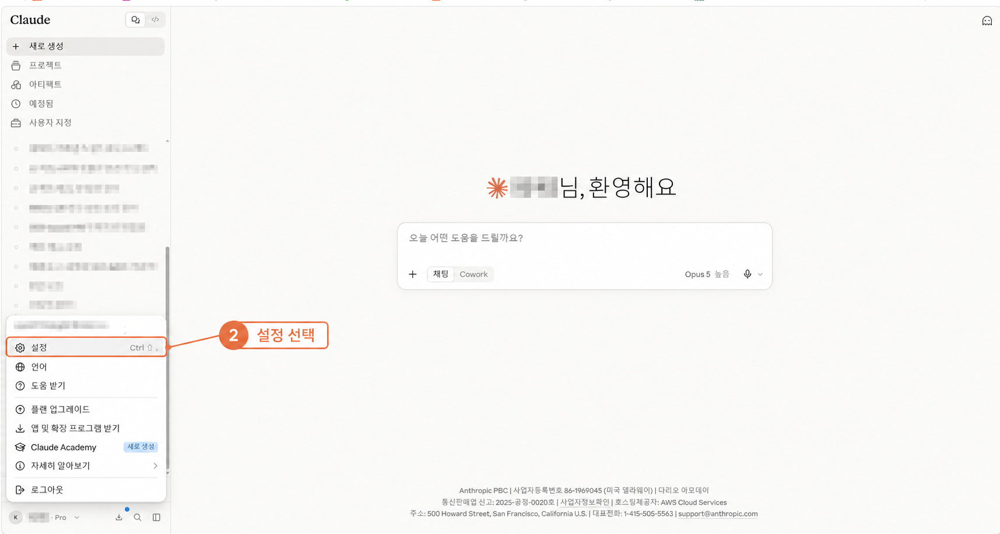
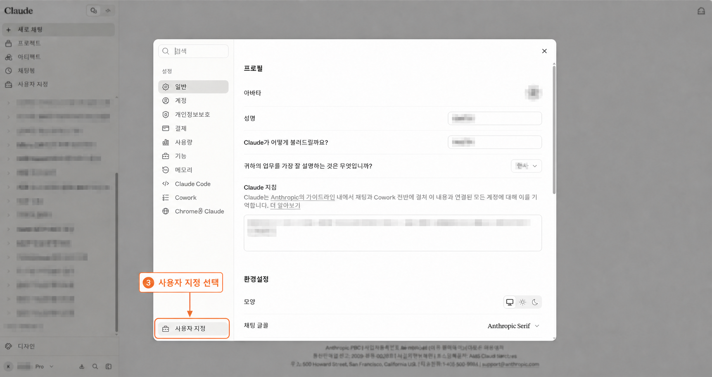
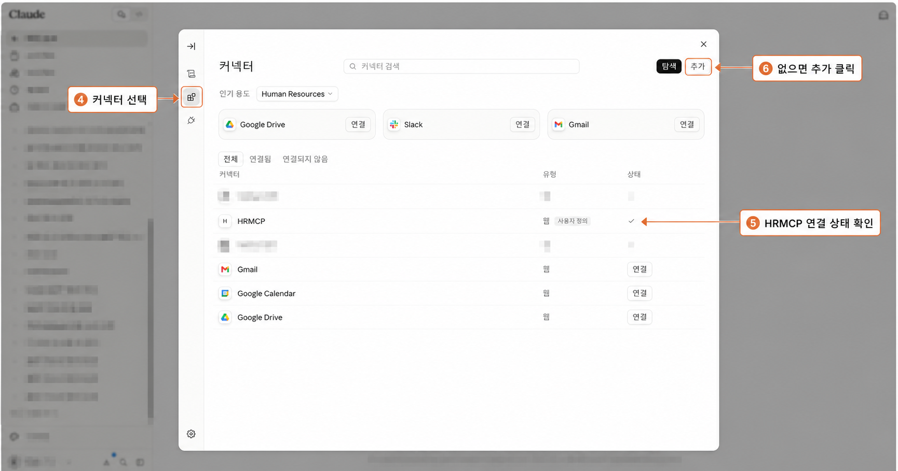
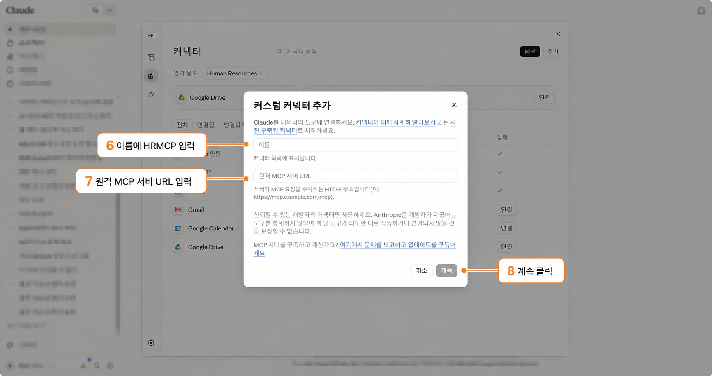
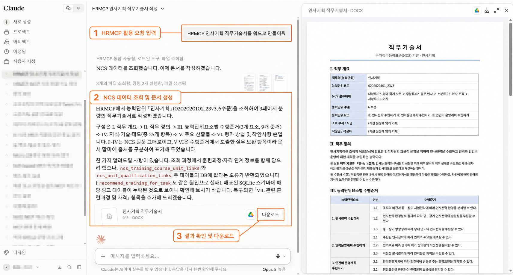
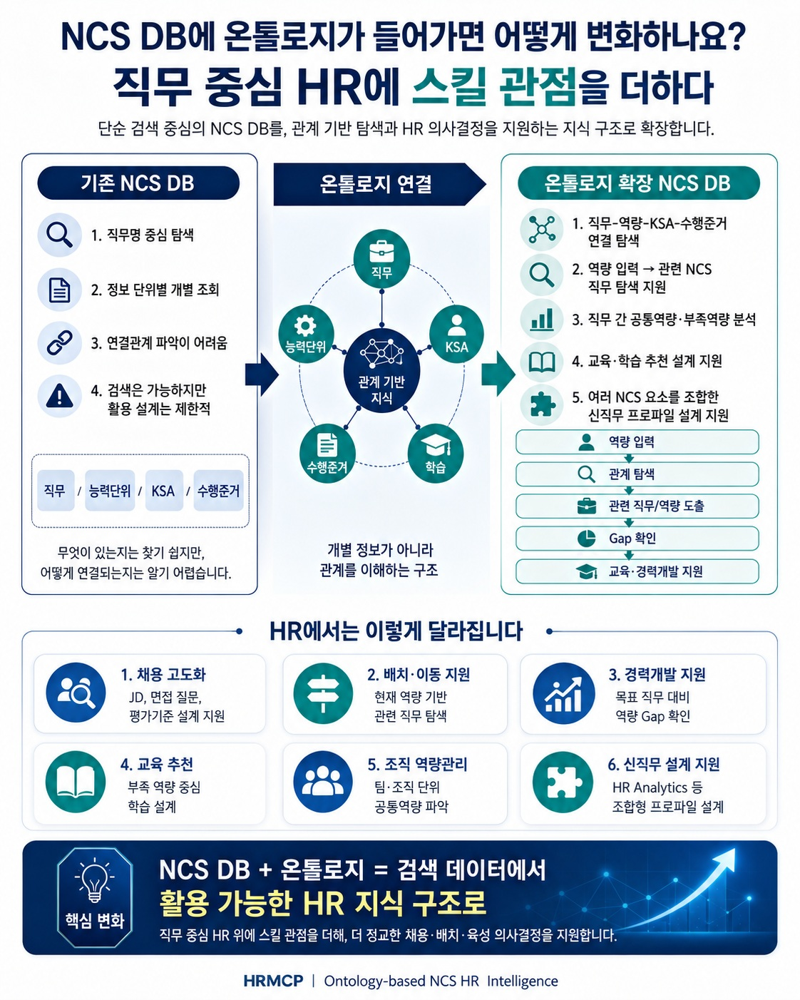
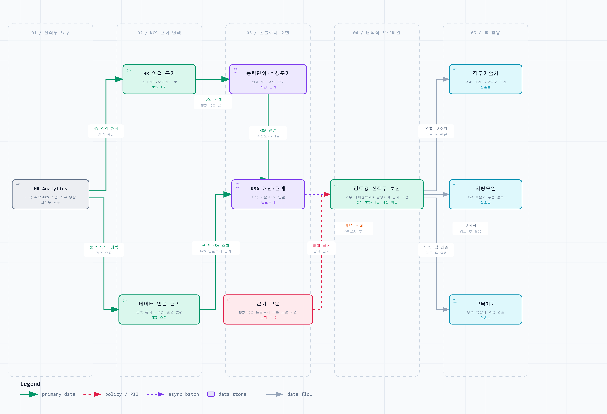

<div align="center">

[](https://github.com/koul777/HRMCP/raw/main/docs/hrmcp_promo.mp4)

**🎬 [고화질 영상(MP4)으로 보기](https://github.com/koul777/HRMCP/raw/main/docs/hrmcp_promo.mp4)** — 위 미리보기를 클릭하면 재생됩니다

</div>

---

# HRMCP — NCS 기반 HR 실무용 MCP

> **HR 실무에서 NCS를 활용하는 가장 빠른 길.**
> 채용 직무에 맞는 NCS 분류부터 능력단위 → 능력단위요소 → 수행준거 → 지식(K)·기술(S)·태도(A)까지,
> 사람이 일일이 찾아 정리하던 정보를 이제 AI가 구조화된 NCS 데이터베이스에서 직접 조회해 활용합니다.

---

## 🚀 HRMCP를 공개합니다

HR 실무에서 NCS를 활용하려면 생각보다 많은 시간과 손이 필요합니다. 채용 직무에 적합한 NCS
분류를 찾고, **능력단위 → 능력단위요소 → 수행준거 → 지식(K)·기술(S)·태도(A)** 를 하나씩 확인한
뒤 다시 정리해야 하기 때문입니다.

HRMCP는 이러한 NCS 데이터를 구조화해, ChatGPT가 필요한 정보를 직접 조회하고 HR 업무에
활용할 수 있도록 만든 **HR 실무용 MCP** 입니다. 쉽게 말하면, 사람이 NCS 사이트에서 일일이
찾고 정리하던 정보를 이제는 AI가 **구조화된 NCS 데이터베이스**에서 직접 찾아 활용할 수 있도록
만든 것입니다.

> 이름 안내: "HRMCP"는 제품/표시 이름이자 MCP 연결 라벨입니다. 내부 파이썬 식별자
> (`ncs_mcp` 패키지, `ncs_*` 도구 이름)는 호환성을 위해 그대로 유지됩니다.

---

## 🧱 핵심은 데이터 전처리입니다

이번 공개까지 약 한 달 동안 NCS 원천 데이터를 정리하고 전처리했습니다. 현재 배포 데이터
기준으로 아래 규모의 데이터를 서로 연결해 **AI가 조회할 수 있는 관계형 구조**로 재구성했습니다.

| 구분 | 규모 |
| --- | --- |
| 능력단위 | **13,435개** |
| 능력단위요소 | **47,620개** |
| 수행준거 | **196,658개** |
| 지식·기술·태도(KSA) | **57만 건 이상** |

공개 서버에는 이 핵심 전처리 결과를 유지한 **경량화 DB**가 탑재돼 있습니다. 일부 직무나
데이터를 샘플로 넣은 것이 아니라, **직무기술서·면접·교육훈련 설계에 필요한 핵심 NCS 데이터는
그대로 유지**하고, 공개 서비스에 불필요한 확장·운영 테이블만 덜어냈습니다.

사용자는 **HTTPS 주소 하나만 연결**하면 되지만, 그 뒤에서는 한 달 동안 구조화한 NCS 데이터가
AI의 검색과 결과물 작성을 뒷받침합니다.

---

## 📌 최근 운영 업데이트

- **2026-08-30**: 공개 MCP 기준 URL을 `https://ncs-mcp-bridge-mini2.vercel.app/api/mcp`로 일원화했습니다. 이전 구버전 엔드포인트 `https://ncs-mcp-bridge.vercel.app/api/mcp`는 현재 `404`로 종료되며 신규 연결에 사용하지 않습니다.
- **2026-08-30**: 서버가 사용하지 않는 독립 `GET /api/mcp` SSE 연결을 열어 둔 채 30초 뒤 종료되던 문제를 수정했습니다. 지원하지 않는 GET은 즉시 `405 Method Not Allowed`로 끝내고, `POST` 기반 `initialize`·`tools/list`·`tools/call` 계약은 유지합니다.
- **2026-08-30**: `ncs_search`·`ncs_unit_detail`·`ncs_training`·`ncs_analysis`의 도구 응답을 원시 JSON 문자열 대신 간결한 마크다운으로 제공합니다. 후속 호출에 필요한 `unit_code`·`element_id`·`criteria_id`·`training_course_id`·`concept_id`는 독립 식별자로 유지하고, 중복 `structuredContent`는 제거했습니다.
- **2026-08-30**: 전체 canonical `ncs.db`를 Vercel에 직접 싣지 않고, 온톨로지·KSA·수행준거·교육추천 근거를 포함한 compact SQLite(425,758,720 bytes)와 배포 ZIP(120,785,873 bytes)으로 만드는 결정론적 Builder·Refresh Builder를 정리했습니다.
- **2026-08-30**: Vercel 함수 검증기가 빌드 폴더의 물리 파일뿐 아니라 `.vc-config.json`의 `filePathMap`까지 확인하도록 강화했습니다. 원본 `.db`·SQLite sidecar·금지 디렉터리 참조가 하나라도 있거나 실제 매핑 총량이 상한을 넘으면 배포를 중단합니다.
- **2026-08-30**: Vercel 릴리스 워크플로에 배포 후 원격 스모크 게이트를 추가했습니다. `GET 405 종료`, `initialize`, `tools/list`, 공개 7개 도구 호출, `ncs_analysis`의 `career_path`·`qualification`·`job_base`·`ontology` 4개 모드를 실제 URL에 대해 검증합니다.
- **2026-08-30**: qualification 스모크를 `광역 자격 조회 → 반환된 능력단위코드 정확 검색 → 해당 능력단위의 자격 조회` 체인으로 확장했습니다. 광역 결과만 존재하고 실제 단위별 조회가 깨진 배포는 승격하지 않으며, 검증 보고서에는 조회 코드와 응답 본문을 기록하지 않습니다.
- **2026-08-30**: 운영 스모크는 `.github/workflows/vercel-snapshot-release.yml`과 `scripts/verify_remote_mcp_transport.py`가 담당합니다. 스냅샷 테이블 누락, raw exception 노출, 공개 도구 응답 회귀가 발생하면 production 승격 전에 릴리스를 중단합니다.
- **2026-08-30**: `initialize`의 `serverInfo.version`에 Git 커밋 SHA, Vercel 배포 ID 또는 스냅샷 해시를 포함해 신·구 배포를 식별할 수 있게 했습니다.
- **2026-08-30**: `ncs_analysis(mode="job_base")` 응답을 필드 화이트리스트와 링크 상한으로 제한하고, 원격 스모크에서 2,000자·1초 계약을 검사하도록 했습니다.
- **2026-08-30**: Vercel compact snapshot의 qualification 계약을 강화했습니다. `ncs_qualification_items`와 `ncs_unit_qualification_links`가 없거나 비어 있으면 패키지 검증과 production 승격이 실패합니다.
- **2026-08-30**: 저장소가 연결하는 NCS API·파일 원천을 전수 구분하고, 공식 레코드·엔드포인트·저장 테이블·이용조건을 [데이터 출처·이용조건 고지](DATA_SOURCE_NOTICE.md)에 기록했습니다.
- **2026-08-30**: 저장소 작성 코드·문서에는 [MIT License](LICENSE)를 적용하고, NCS 원천 데이터·배포 snapshot·OCR·vendor·제3자 자산의 별도 권리와 출처는 [NOTICE](NOTICE)와 데이터 출처 고지로 분리했습니다.

위 mini2 URL은 현재 공개 MCP의 canonical endpoint입니다. 원격 transport와 핵심 도구 계약은 자동으로
검증하지만, 전체 AI-HR 제품의 안정 릴리스 판정과 사람 검토가 필요한 데이터 판단은 별도 승인 절차로
남아 있습니다.

---

## 💡 HRMCP로 할 수 있는 일

- **구조화된 면접 질문 설계** — 채용공고와 직무기술서를 바탕으로 행동면접 질문, 추가 질문,
  평가요소를 설계할 수 있습니다.
- **NCS 기반 직무기술서 작성** — 채용 직무에 적합한 NCS 분류와 능력단위를 찾아 직무기술서를
  작성할 수 있습니다.
- **교육훈련 계획 수립** — 직무별 지식·기술·태도를 분석해 교육과정, 학습목표, 교육내용을
  설계할 수 있습니다.

> ℹ️ HRMCP의 결과물은 **교육·업무 설계를 돕는 참고 자료**이며, 공식 자격·채용·법적·규정 판단을
> 대체하지 않습니다.

---

## 🔌 HRMCP 연결 방법

ChatGPT와 Claude는 HRMCP를 연결하는 메뉴와 명칭이 다릅니다. 사용하는 플랫폼의 연결 절차를
선택해 진행하세요. 연결을 마친 뒤의 실제 요청 방법은 [HRMCP 사용 방법](#-hrmcp-사용-방법)에서
확인할 수 있습니다.

### ChatGPT 연결

> 아래 이미지는 ChatGPT Pro 화면 기준입니다. 예시 화면에서는 플러그인 이름을 `rmcp`로
> 만들었지만, 이름은 **HRMCP** 또는 본인이 사용하기 편한 이름으로 지정하면 됩니다.

#### 1️⃣ 왼쪽 아래 프로필을 클릭합니다


#### 2️⃣ 메뉴에서 설정으로 이동합니다


#### 3️⃣ 설정 → 플러그인으로 이동한 뒤, 목록을 아래로 내립니다


#### 4️⃣ 목록 맨 아래의 개발자 모드를 클릭합니다


#### 5️⃣ 개발자 모드를 ON으로 변경합니다


#### 6️⃣ 왼쪽 메뉴에서 플러그인을 선택합니다


#### 7️⃣ 오른쪽 위의 `+` 버튼을 클릭합니다


#### 8️⃣ 새 플러그인 정보를 입력합니다

- **이름:** `HRMCP` 또는 본인이 사용하기 편한 이름
- **연결 방식:** `서버 URL`
  - **서버 URL:** 아래 HTTPS MCP 주소를 그대로 복사해 붙여넣기

    ```text
    https://ncs-mcp-bridge-mini2.vercel.app/api/mcp
    ```

- **인증 방식:** `인증 없음` 선택 (드롭다운의 `∨`를 클릭해 선택)


#### 9️⃣ 안내사항 확인란에 체크한 뒤 만들기를 클릭합니다


#### 🔟 연결하기를 누르면 설정이 완료됩니다


### Claude 연결

Claude의 원격 MCP 커스텀 커넥터는 Free·Pro·Max·Team·Enterprise 플랜에서 사용할 수
있습니다. Free 플랜은 커스텀 커넥터를 1개까지 등록할 수 있습니다.
자세한 최신 정책은 [Anthropic 공식 안내](https://support.claude.com/ko/articles/11175166-%EC%9B%90%EA%B2%A9-mcp%EB%A5%BC-%EC%82%AC%EC%9A%A9%ED%95%98%EC%97%AC-%EC%82%AC%EC%9A%A9%EC%9E%90-%EC%A0%95%EC%9D%98-%EC%BB%A4%EB%84%A5%ED%84%B0-%EC%8B%9C%EC%9E%91%ED%95%98%EA%B8%B0)와
[Claude Academy의 현재 화면 안내](https://academy.claude.com/tutorials/connect-your-tools-to-unlock-a-smarter-more-capable-ai-companion)를 참고하세요.

#### 개인 플랜 (Free·Pro·Max)

Claude 웹 화면에서 다음 순서에 따라 커넥터를 직접 추가합니다.

1. Claude 홈 화면 왼쪽 아래의 **프로필**을 클릭합니다.



2. 열린 프로필 메뉴에서 **설정**을 선택합니다.



3. 설정 창 왼쪽 아래의 **사용자 지정**을 선택합니다.



4. 사용자 지정 화면 왼쪽에서 **커넥터**를 선택합니다.

5. 오른쪽 위의 **추가**를 클릭합니다.



6. **추가**를 누르면 **커스텀 커넥터 추가** 창이 열립니다. **이름**에 `HRMCP`를 입력합니다.

7. **원격 MCP 서버 URL**에 `https://ncs-mcp-bridge-mini2.vercel.app/api/mcp`를 입력합니다.

8. 두 값을 확인한 뒤 **계속**을 클릭해 등록을 진행합니다.



**계속**을 누르면 연결 설정이 진행됩니다. 확인 단계가 표시되면 내용을 확인해 등록을
마칩니다. HRMCP는 인증이 필요하지 않으므로 OAuth Client ID·Secret은 입력하지 않습니다.

> Claude 업데이트나 계정 유형에 따라 메뉴 배치나 버튼 이름이 조금 달라질 수 있습니다.

#### Team·Enterprise 플랜

1. 조직의 **Owner 또는 Primary Owner**가 **Organization settings → Connectors** 로
   이동합니다.
2. **Add → Custom → Web** 을 선택하고 위의 원격 MCP 서버 URL을 입력합니다.
3. OAuth 고급 설정은 비워 둔 채 **Add** 를 클릭해 조직에 등록합니다.
4. 각 구성원은 **설정 → 사용자 지정 → 커넥터**에서 `HRMCP`를 찾아 **연결**을 클릭합니다.

---

## 💬 HRMCP 사용 방법

위의 ChatGPT 또는 Claude 연결 절차를 마친 뒤 HRMCP를 사용할 수 있습니다. 연결 방식은
플랫폼마다 다릅니다. 아래는 ChatGPT에서 구조화된 행동면접 질문을 만들고, Claude에서 NCS
직무기술서를 DOCX 문서로 만드는 사용 예시입니다.

### ChatGPT에서 사용하기 — 구조화된 행동면접 질문

채팅창에서 등록한 이름 앞에 `@`를 붙여 HRMCP를 선택한 뒤 요청합니다. 연결 이름을
`HRMCP`로 만들었다면 다음과 같이 입력합니다.


```text
@HRMCP 첨부한 채용공고와 직무기술서를 참고해 구조화된 행동면접 질문 10개를 작성해줘.
각 질문별 평가요소, 추가 질문, 긍정적·부정적 행동지표도 함께 제시해줘.
```


### Claude에서 사용하기 — NCS 직무기술서 작성

새 대화에서 다음과 같이 요청합니다. Claude에서는 `@HRMCP`를 붙일 필요가 없습니다.
도구 사용 권한 확인 창이 표시되면 내용을 확인한 뒤 허용합니다.

```text
HRMCP 인사기획 직무기술서를 워드로 만들어줘
```

아래 화면은 Claude가 HRMCP에서 인사기획 능력단위와 NCS 근거를 조회한 뒤 직무기술서를
DOCX 문서로 생성하고, 결과를 미리 보거나 다운로드하는 활용 예시입니다.



> HRMCP가 호출되지 않으면 **설정 → 사용자 지정 → 커넥터**에서 `HRMCP` 행의 체크 표시를
> 확인하세요. 대화 입력창에 도구 선택 메뉴가 표시되는 계정에서는 해당 메뉴에서도 HRMCP가
> 허용되어 있는지 확인합니다.

---

## ⚠️ 이용 시 주의사항 (공개 테스트 단계)

현재 HRMCP는 **공개 테스트 단계**입니다.

- **개인정보, 지원자 정보, 기관 내부자료, 비공개 문서** 등 민감한 정보는 제외하고 사용해 주세요.
- 결과물은 참고용이며, 공식 자격·채용·법적·규정 판단의 근거로 사용하지 마세요.
- 서비스 안정성 및 데이터는 예고 없이 변경될 수 있습니다.

---

## 🧩 연결 정보 요약

| 항목 | 값 |
| --- | --- |
| MCP 서버 URL | `https://ncs-mcp-bridge-mini2.vercel.app/api/mcp` |
| 인증 | 없음 (Auth: None) |
| 상태 확인(health) | `https://ncs-mcp-bridge-mini2.vercel.app/api/health` |
| 준비 확인(ready) | `https://ncs-mcp-bridge-mini2.vercel.app/api/ready` |

ChatGPT Custom GPT(Agent/Tools) 설정에서는 아래 JSON의 `url`만 넣으면 됩니다.

```json
{
  "mcpServers": {
    "hrmcp": {
      "url": "https://ncs-mcp-bridge-mini2.vercel.app/api/mcp"
    }
  }
}
```

---

## 🗂️ HRMCP가 하는 일 (기술 개요)

- NCS 계층 구조(분류·능력단위·능력단위요소·수행준거)와 원천 KSA 행을 원본 그대로 보존합니다.
- 원천 KSA 텍스트를 덮어쓰지 않고 KSA/과업 온톨로지 테이블을 구축합니다.
- 교육과정의 목표·시간·방법·시설과 NCS 단위 근거를 과업/KSA 추천 근거에 연결합니다.
- 경력 전환 및 과업 기반 교육훈련 추천을 간결한 근거 요약과 함께 제공합니다.
- NCS 경력경로, 자격항목 API, 직무기초능력 API에서 보조 근거를 추가합니다.
- NCS 구조 검색, 온톨로지 조회, 교육과정 검색, AI-HR 교육경로 설계를 위한 MCP 도구를 노출합니다.
- 자연어 요청을 공개 도구로 라우팅하고 운영자 워크플로를 차단하는 읽기 전용 기관 챗봇
  참고 UI/API를 별도로 포함합니다.

> 현재 제품 범위는 NCS 중심입니다. SQF 및 NCS 학습모듈 플로우는 과거 테이블이나 호환성
> 코드에 남아 있을 수 있으나, 운영자가 명시적으로 다시 활성화하지 않는 한 레거시/참고
> 영역입니다.

### 데이터 흐름

```text
NCS Excel/원천 데이터
  → 분류(classifications)
  → 능력단위(competency_units)
  → 능력단위요소(competency_elements)
  → 수행준거(performance_criteria)
  → 원천 KSA 행(raw KSA)
  → KSA/과업 온톨로지 → 추천 근거(recommendation evidence)
```

---

## 🖥️ 셀프 호스팅 / 배포 (관리자용)

### 로컬 실행 (읽기 전용 기본값)

로컬 런처는 기본적으로 읽기 전용 SQLite 서빙으로 동작하며 운영자 MCP 도구를 감춥니다.

```powershell
.\run_ncs_mcp_http.cmd     # 로컬 HTTP MCP 서버
.\run_ncs_institutional_chat.cmd   # 기관 챗봇 참고 UI/API
```

- 로컬 HTTP: `http://127.0.0.1:8766/mcp` / health `http://127.0.0.1:8766/health`
- 참고 챗 UI: `http://127.0.0.1:8780/`

기본적으로 루프백 외 바인딩은 거부됩니다. 강화된 컨테이너 예시는
`deploy/compose.internal.yml`에 있으며, 신원·TLS·사용자 권한은 기관 게이트웨이
(`docs/INSTITUTIONAL_CHATBOT_SELF_HOST_GUIDE.md`)에서 처리해야 합니다.

### Vercel 배포 (Streamable HTTP)

ChatGPT 연결은 주소 한 줄(`/api/mcp`)만 넣으면 됩니다. 전체 배포 가이드는
`docs/README_VERCEL_HTTPS.md`를 참고하세요.

- 기준 입력은 운영자가 준비한 단일 canonical DB `data/processed/ncs.db`
  (12,648,931,328 bytes)입니다. Publisher가 이를 stage·verify한 뒤 compact SQLite
  (425,758,720 bytes)와 `api/ncs_ontology_compact.zip`(120,785,873 bytes), manifest
  쌍을 원자적으로 publish합니다. 실패하면 기존 쌍을 rollback합니다.
- `deploy/vercel_mcp_app/vercel.json`은 함수 진입점(`api/index.py`)과 ZIP/manifest
  포함 규칙을 정의합니다. 측정된 production function bundle은 131.54MB입니다.
- `api/mcp.py`는 시작 시 ZIP과 manifest를 검증한 뒤 `/tmp/ncs_ontology_compact.db`에
  DB를 materialize하여 read-only로 엽니다. 요청 시 NCS API를 수집하거나 AI 모델을
  호출하지 않습니다. `NCS_DB_URL`은 표준 배포 의존성이 아닙니다.
- 현재 production MCP URL은 `https://ncs-mcp-bridge-mini2.vercel.app/api/mcp`이고,
  배포 식별자는 `dpl_94usxf3AP6AjSdN8cySr1bu9fJK7`입니다.

Vercel 런타임 설정은 `deploy/vercel_mcp_app/vercel.json`에 포함되어 있습니다.

```text
NCS_MCP_READ_ONLY=1
NCS_MCP_ENABLE_OPERATOR_TOOLS=0
NCS_MCP_DISABLE_DNS_REBINDING_PROTECTION=1
NCS_MCP_STREAMABLE_HTTP_PATH=/mcp
NCS_MCP_MAX_CONCURRENT_RECOMMENDATIONS=2
NCS_MCP_READINESS_EXTRA_TABLES=ontology_concepts,...,ncs_unit_standard_training
```

```powershell
cd deploy\vercel_mcp_app
vercel deploy
vercel deploy --prod
```

새 원천 DB로 교체할 때는 먼저 변경 인식형 Refresh Builder로 계획을 확인하고 별도 준비본을
만듭니다. 성공 보고서의 `publisher_source.path`만 Publisher 입력으로 사용합니다.

```powershell
python scripts\refresh_ncs_ontology.py data\processed\ncs.db --report reports\refresh-plan.json
python scripts\refresh_ncs_ontology.py data\processed\ncs.db --output build\prepared\ncs.db --report reports\refresh-apply.json --apply
python scripts\publish_vercel_snapshot.py --source <publisher_source.path>
```

필요하면 `--deploy-root`, `--dry-run`, `--report`를 추가할 수 있습니다. Publisher는
검증된 ZIP과 manifest만 `deploy/vercel_mcp_app/api/`에 함께 publish하며, 자체적으로 API를
수집하거나 Vercel을 배포하지 않습니다. 별도 출력 경로가 필요한 경우에만 low-level
`build_vercel_snapshot.py`를 사용하세요. 전체 자동 갱신·staged 배포·원격 검증·기준본 승격은
`.github/workflows/vercel-snapshot-release.yml`이 담당합니다. 자격 API의 운영자 승인 절차는
자동화 범위 밖에 그대로 유지됩니다.

### API 키 발급

NCS API 키는 이 저장소 외부에서 발급합니다. 공공데이터포털(HRDK/NCS API 호스팅)에서 필요한
서비스에 접근을 신청하고, 발급된 서비스 키를 로컬 `.env`에 넣습니다.

- `NCS_SERVICE_KEY` — NCS 참조 API 키
- `NCS_TRAINING_COURSE_SERVICE_KEY` — NCS 교육과정 API 키
- `NCS_QUALIFICATION_SERVICE_KEY` — NCS 단위 자격항목 API 키
- `NCS_JOB_BASE_SERVICE_KEY` — NCS 직무기초능력 API 키

> `.env`는 커밋하지 마세요. 실제 키를 보고서·로그·이슈·스크린샷에 붙여넣지 마세요.

---

## 📄 코드 라이선스·데이터 출처·면책

저장소가 작성한 코드와 문서는 [MIT License](LICENSE)로 제공합니다. 이 라이선스는 NCS 원천 데이터,
가공 DB와 배포 snapshot, OCR 모델, vendor 코드, 다운로드 문서·이미지 등 제3자 자료의 권리를
변경하거나 재허락하지 않습니다. 각 자료에는 원 출처의 이용조건과 제3자 권리가 별도로 적용되며,
요약 경계와 필수 고지는 [NOTICE](NOTICE)에서 확인할 수 있습니다.

생성 운영 DB와 배포 snapshot ZIP은 Git 소스 파일로 추적하지 않습니다. 다만 Vercel 릴리스는 검증된
compact SQLite snapshot을 별도 배포 산출물로 스테이징하고, 런타임에서 읽기 전용으로 materialize할 수
있습니다. 따라서 **Git 미포함**과 **배포 산출물 사용**은 서로 다른 경계입니다.

### 연결된 외부 데이터 원천

| 구분 | 공식 출처·연결 | 현재 역할 |
| --- | --- | --- |
| NCS 정보망 Excel DB | NCS 누리집에서 취득한 `ncs_info_network_db_2026_02.xlsx` | 분류·능력단위·요소·수행준거·원천 KSA의 canonical 기반 |
| NCS 기준정보 API | [공공데이터포털 15128213](https://www.data.go.kr/data/15128213/openapi.do), `hrdkapi/NCS004·005·006` | 직무·능력단위 정의 보강과 요소 검증 |
| NCS 훈련과정 API | [공공데이터포털 15086447](https://www.data.go.kr/data/15086447/openapi.do), `ncsTrainingCource/openapi18` | 훈련목표·시간·시설·방법을 교육추천 근거로 연결 |
| 능력단위별 자격 API | [공공데이터포털 15074404](https://www.data.go.kr/data/15074404/openapi.do), `ncsClCdJm/getNcsClCdJmList` | 능력단위와 자격 종목의 보조 근거 |
| NCS 직업기초능력 API | [공공데이터포털 15086440](https://www.data.go.kr/data/15086440/openapi.do), `ncsJobBase/openapi19` | 공통·부족 기초역량의 보조 근거 |
| NCS 경력개발경로 CSV | NCS 누리집 파일을 `ncs_career_paths`로 import | 직무 전환·성장 단계의 보조 근거 |

CQ-Net NCS 관련 정보, 학습모듈, SQF 관련 API·자료실 코드는 레거시·참조용이며 현재 공개 HRMCP의
기본 추천 경로에 사용하지 않습니다. API별 공식 이용허락 표시, 파일별 공공누리 확인 상태, 코드
연결 지점과 저장 테이블은 [데이터 출처·이용조건 고지](DATA_SOURCE_NOTICE.md)에 하나씩 정리했습니다.
공공데이터포털 API 레코드의 `이용허락범위 제한 없음` 표시는 해당 API 레코드에 대한 확인이며,
NCS 누리집에서 직접 받은 Excel·CSV·PDF·이미지·자료실 첨부파일에 자동으로 확대 적용하지 않습니다.

HRMCP의 추천·생성 결과는 교육·업무 설계를 돕는 참고 자료이며, 공식 NCS 정의·자격 인정·채용·법적·규정
판단이 아닙니다. NCS 원천 데이터의 권리는 한국산업인력공단 등 각 원 권리자에게 있습니다.

---

## 🧠 온톨로지로 HRMCP가 달라지는 점



### 핵심 변화: 검색 DB에서 관계 기반 HR 지식 구조로

기존 NCS DB는 직무, 능력단위, KSA, 수행준거처럼 **무엇이 있는지 찾고 개별 정보를 조회하는
데 강점**이 있습니다. HRMCP의 온톨로지 DB는 이 원천 정보를 바꾸지 않고 별도의 개념·링크·관계
테이블을 더해 **직무 ↔ 능력단위 ↔ 수행준거 ↔ KSA ↔ 교육과정**을 연결해서 탐색할 수 있게
합니다. 즉, 직무 분류를 없애는 것이 아니라 직무 중심 NCS 위에 스킬 관점을 추가하는 구조입니다.

| 기존 NCS DB 활용 | 온톨로지 확장 후 활용 |
| --- | --- |
| 직무명과 정보 단위별 개별 조회 | 직무·역량·KSA·수행준거 사이의 관계 탐색 |
| 검색어와 일치하는 항목 확인 | 입력한 역량에서 관련 NCS 직무와 능력단위로 탐색 확장 |
| 각 직무의 요구사항을 따로 비교 | 직무 간 공통역량·부족역량과 전이 가능한 KSA 분석 |
| 과정명이나 분류 중심 교육 검색 | 부족 KSA를 수행준거·훈련목표·수준·시간·방법과 연결 |
| NCS에 존재하는 분류 범위 중심 활용 | 여러 NCS 근거를 조합한 탐색적 신직무 프로파일 설계 지원 |

대표적인 활용 흐름은 **역량 입력 → 관계 탐색 → 관련 직무·역량 도출 → KSA Gap 확인 →
교육·경력개발 지원**입니다. 이 흐름은 문자열이 비슷하다는 이유만으로 결론을 내리는 방식이 아니라,
실제 NCS 능력단위·수행준거·KSA와 저장된 온톨로지 관계를 근거로 결과를 추적할 수 있게 합니다.

### 핵심 데이터 규모

| 데이터 | 현재 규모 | 활용 |
| --- | ---: | --- |
| NCS 능력단위 | 13,435건 | 직무와 가장 가까운 능력단위를 찾는 기본 축 |
| 수행준거 | 196,658건 | 면접 질문·직무기술서·교육 추천의 세부 근거 |
| 원천 KSA | 574,279건 | 직무 수행에 필요한 지식·기술·태도 원문 근거 |
| 온톨로지 개념 노드 | 533,909건 | 표현을 대표 개념으로 연결하고 인접 역량을 탐색하는 축 |
| 수행준거–개념 연결 | 3,025,498건 | 수행준거와 관련 KSA 개념을 잇는 중복 제거 논리 관계 |
| 개념 간 온톨로지 관계 | 3,235,434건 | 지식·기술·태도 개념 사이를 연결하는 논리 관계 |
| 교육과정 | 11,819건 | 부족 역량과 연결해 검토하는 교육훈련 과정 |

두 핵심 관계 계층은 합계 **6,260,932건**입니다. 경량판에서는 이 관계를 삭제하지 않고 여러 관계
ID를 한 행의 압축 목록(posting)에 묶어 저장하므로, SQLite의 물리 행 수와 위의 논리 관계 건수는
다릅니다.
건수는 현재 검증된 배포 데이터 기준이며, 원 NCS 데이터와 API 자료가 갱신되면 달라질 수 있습니다.

### HR에서 달라지는 6가지 활용

| HR 업무 | 온톨로지가 지원하는 작업 |
| --- | --- |
| **채용 고도화** | 직무기술서, 구조화 행동면접 질문, 평가요소와 행동지표를 수행준거·KSA 근거에 연결 |
| **배치·이동 지원** | 현재 역량과 인접 직무의 공통 KSA를 비교하고 이동 후보와 추가 확인 항목을 탐색 |
| **경력개발 지원** | 목표 직무 대비 보유·부족 역량을 구분해 업스킬링·리스킬링 경로 초안 작성 |
| **교육 추천** | 부족 KSA를 교육과정의 훈련목표·수준·시간·방법·시설 근거와 연결해 과정 묶음 검토 |
| **조직 역량관리** | 팀·조직에 필요한 공통역량 후보와 직무군별 역량 구조를 파악하는 초안 제공 |
| **신직무 설계 지원** | HR Analytics, AI HR처럼 여러 NCS 영역에 걸친 역할의 근거를 조합해 탐색적 프로파일 설계 |

온톨로지는 채용·배치·승진을 자동 판정하지 않습니다. 관계 탐색 결과와 추천은 HR 담당자가 검토할
수 있는 **근거와 초안**이며, 조직별 중요도·직급 수준·보유역량·운영 여건은 별도로 확인해야 합니다.

### NCS에 없는 신직무의 탐색적 설계

HRMCP는 `HR Analytics`처럼 NCS에 동일 명칭의 분류·능력단위가 없는 역할에 대해서도 `인사기획`,
`인사평가`, `통계조사`, `빅데이터분석`, `빅데이터 분석 결과 시각화` 등 실제 NCS 범위의 근거를
각각 조회할 수 있습니다. HR 담당자나 외부 에이전트가 이 조회 결과의 능력단위·수행준거·KSA를
조합하면 **탐색적 신직무 프로파일 초안**으로 활용할 수 있습니다.



- **NCS 직접 근거**: 실제 능력단위, 능력단위요소, 수행준거, KSA, 훈련과정
- **온톨로지 기반 연결**: 저장된 개념·별칭·관계를 따라 찾은 인접 근거
- **모델·조직 제안**: 역할 구조, 중요도, NCS 밖의 추가 역량

현재 공개 MCP가 신직무를 한 번에 자동 분해하거나 조직별 프로파일을 DB에 저장하는 것은 아닙니다.
여러 조회 결과는 ChatGPT·Claude 같은 외부 에이전트와 HR 담당자가 조합하며, 포함 범위·중요도·
역할 수준·조직 고유 역량은 사람이 확정해야 합니다. 결과는 공식 NCS 정의나 채용 판정이 아니라
직무기술서·역량모델·교육체계 설계를 위한 검토용 초안입니다.

### 경량 배포와 데이터 갱신

Vercel에는 전체 운영 DB 대신 온톨로지와 교육 추천에 필요한 **500MB 이하의 읽기 전용 경량
스냅샷**을 배포합니다. Builder와 Vercel 런타임은 AI 모델을 실행하거나 요청 시점에 NCS API를
수집하지 않으며, 원 데이터 갱신·변경 감지·검증·배포는 별도의 재현 가능한 파이프라인에서
처리합니다.

릴리스는 추적된 파일만 복사한 clean staging에서 조립하며, 실제 Vercel `filePathMap`에서 원본 DB가
0건인지 확인합니다. 현재 검증된 함수 매핑 총량은 169,354,715 bytes이고, 런타임에 펼쳐지는
SQLite는 425,758,720 bytes입니다. 압축 해제 공간의 여유가 크지 않으므로 DB가 증가하면 Builder의
축소 기준과 `/tmp` 사용량을 다시 점검해야 합니다.

- [경량 DB Builder·Refresh Builder·Vercel 배포 절차](docs/VERCEL_SNAPSHOT_BUILDER.md)
- [Vercel 배포 구조·전체 포함 데이터·운영 범위](docs/README_VERCEL_HTTPS.md)
- [원천 데이터·온톨로지 계층·불변조건](ARCHITECTURE.md)

경량판도 원천 KSA를 덮어쓰지 않고, 검토되지 않은 정의나 후보를 자동 승인하지 않습니다.
