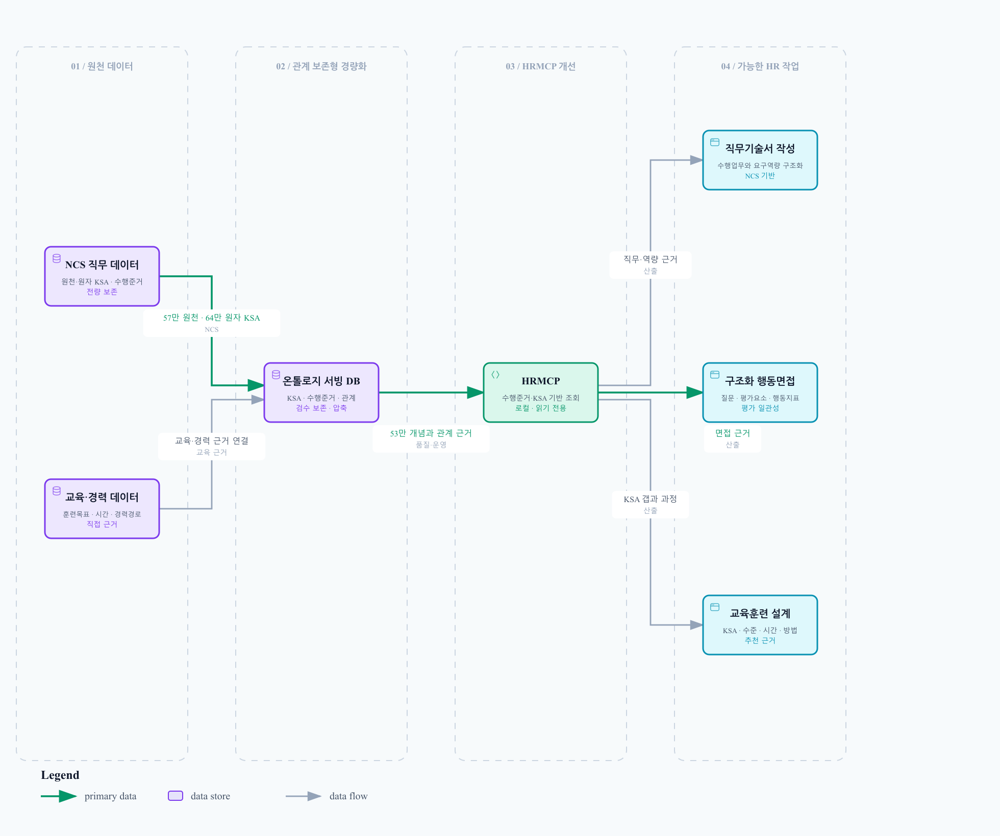

<div align="center">

[](https://github.com/koul777/HRMCP/raw/main/docs/hrmcp_promo.mp4)

**🎬 [고화질 영상(MP4)으로 보기](https://github.com/koul777/HRMCP/raw/main/docs/hrmcp_promo.mp4)** — 위 미리보기를 클릭하면 재생됩니다

</div>

---

# HRMCP — NCS 기반 HR 실무용 MCP

> **HR 실무에서 NCS를 활용하는 가장 빠른 길.**
> 채용 직무에 맞는 NCS 분류부터 능력단위 → 능력단위요소 → 수행준거 → 지식(K)·기술(S)·태도(A)까지,
> 사람이 일일이 찾아 정리하던 정보를 이제 AI가 구조화된 NCS 데이터베이스에서 직접 조회해 활용합니다.

---

## 🚀 HRMCP를 공개합니다

HR 실무에서 NCS를 활용하려면 생각보다 많은 시간과 손이 필요합니다. 채용 직무에 적합한 NCS
분류를 찾고, **능력단위 → 능력단위요소 → 수행준거 → 지식(K)·기술(S)·태도(A)** 를 하나씩 확인한
뒤 다시 정리해야 하기 때문입니다.

HRMCP는 이러한 NCS 데이터를 구조화해, ChatGPT가 필요한 정보를 직접 조회하고 HR 업무에
활용할 수 있도록 만든 **HR 실무용 MCP** 입니다. 쉽게 말하면, 사람이 NCS 사이트에서 일일이
찾고 정리하던 정보를 이제는 AI가 **구조화된 NCS 데이터베이스**에서 직접 찾아 활용할 수 있도록
만든 것입니다.

> 이름 안내: "HRMCP"는 제품/표시 이름이자 MCP 연결 라벨입니다. 내부 파이썬 식별자
> (`ncs_mcp` 패키지, `ncs_*` 도구 이름)는 호환성을 위해 그대로 유지됩니다.

---

## 🧱 핵심은 데이터 전처리입니다

이번 공개까지 약 한 달 동안 NCS 원천 데이터를 정리하고 전처리했습니다. 현재 배포 데이터
기준으로 아래 규모의 데이터를 서로 연결해 **AI가 조회할 수 있는 관계형 구조**로 재구성했습니다.

| 구분 | 규모 |
| --- | --- |
| 능력단위 | **13,435개** |
| 능력단위요소 | **47,620개** |
| 수행준거 | **196,658개** |
| 지식·기술·태도(KSA) | **57만 건 이상** |

공개 서버에는 이 핵심 전처리 결과를 유지한 **경량화 DB**가 탑재돼 있습니다. 일부 직무나
데이터를 샘플로 넣은 것이 아니라, **직무기술서·면접·교육훈련 설계에 필요한 핵심 NCS 데이터는
그대로 유지**하고, 공개 서비스에 불필요한 확장·운영 테이블만 덜어냈습니다.

사용자는 **HTTPS 주소 하나만 연결**하면 되지만, 그 뒤에서는 한 달 동안 구조화한 NCS 데이터가
AI의 검색과 결과물 작성을 뒷받침합니다.

---

## 💡 HRMCP로 할 수 있는 일

- **구조화된 면접 질문 설계** — 채용공고와 직무기술서를 바탕으로 행동면접 질문, 추가 질문,
  평가요소를 설계할 수 있습니다.
- **NCS 기반 직무기술서 작성** — 채용 직무에 적합한 NCS 분류와 능력단위를 찾아 직무기술서를
  작성할 수 있습니다.
- **교육훈련 계획 수립** — 직무별 지식·기술·태도를 분석해 교육과정, 학습목표, 교육내용을
  설계할 수 있습니다.

> ℹ️ HRMCP의 결과물은 **교육·업무 설계를 돕는 참고 자료**이며, 공식 자격·채용·법적·규정 판단을
> 대체하지 않습니다.

---

## 🔌 HRMCP 연결 방법

ChatGPT와 Claude는 HRMCP를 연결하는 메뉴와 명칭이 다릅니다. 사용하는 플랫폼의 연결 절차를
선택해 진행하세요. 연결을 마친 뒤의 실제 요청 방법은 [HRMCP 사용 방법](#-hrmcp-사용-방법)에서
확인할 수 있습니다.

### ChatGPT 연결

> 아래 이미지는 ChatGPT Pro 화면 기준입니다. 예시 화면에서는 플러그인 이름을 `rmcp`로
> 만들었지만, 이름은 **HRMCP** 또는 본인이 사용하기 편한 이름으로 지정하면 됩니다.

#### 1️⃣ 왼쪽 아래 프로필을 클릭합니다


#### 2️⃣ 메뉴에서 설정으로 이동합니다


#### 3️⃣ 설정 → 플러그인으로 이동한 뒤, 목록을 아래로 내립니다


#### 4️⃣ 목록 맨 아래의 개발자 모드를 클릭합니다


#### 5️⃣ 개발자 모드를 ON으로 변경합니다


#### 6️⃣ 왼쪽 메뉴에서 플러그인을 선택합니다


#### 7️⃣ 오른쪽 위의 `+` 버튼을 클릭합니다


#### 8️⃣ 새 플러그인 정보를 입력합니다

- **이름:** `HRMCP` 또는 본인이 사용하기 편한 이름
- **연결 방식:** `서버 URL`
  - **서버 URL:** 아래 HTTPS MCP 주소를 그대로 복사해 붙여넣기

    ```text
    https://ncs-mcp-bridge-mini2.vercel.app/api/mcp
    ```

- **인증 방식:** `인증 없음` 선택 (드롭다운의 `∨`를 클릭해 선택)


#### 9️⃣ 안내사항 확인란에 체크한 뒤 만들기를 클릭합니다


#### 🔟 연결하기를 누르면 설정이 완료됩니다


### Claude 연결

Claude의 원격 MCP 커스텀 커넥터는 Free·Pro·Max·Team·Enterprise 플랜에서 사용할 수
있습니다. Free 플랜은 커스텀 커넥터를 1개까지 등록할 수 있습니다.
자세한 최신 정책은 [Anthropic 공식 안내](https://support.claude.com/ko/articles/11175166-%EC%9B%90%EA%B2%A9-mcp%EB%A5%BC-%EC%82%AC%EC%9A%A9%ED%95%98%EC%97%AC-%EC%82%AC%EC%9A%A9%EC%9E%90-%EC%A0%95%EC%9D%98-%EC%BB%A4%EB%84%A5%ED%84%B0-%EC%8B%9C%EC%9E%91%ED%95%98%EA%B8%B0)와
[Claude Academy의 현재 화면 안내](https://academy.claude.com/tutorials/connect-your-tools-to-unlock-a-smarter-more-capable-ai-companion)를 참고하세요.

#### 개인 플랜 (Free·Pro·Max)

Claude 웹 화면에서 다음 순서에 따라 커넥터를 직접 추가합니다.

1. Claude 홈 화면 왼쪽 아래의 **프로필**을 클릭합니다.


2. 열린 프로필 메뉴에서 **설정**을 선택합니다.


3. 설정 창 왼쪽 아래의 **사용자 지정**을 선택합니다.


4. 사용자 지정 화면 왼쪽에서 **커넥터**를 선택합니다.

5. 오른쪽 위의 **추가**를 클릭합니다.


6. **추가**를 누르면 **커스텀 커넥터 추가** 창이 열립니다. **이름**에 `HRMCP`를 입력합니다.

7. **원격 MCP 서버 URL**에 `https://ncs-mcp-bridge-mini2.vercel.app/api/mcp`를 입력합니다.

8. 두 값을 확인한 뒤 **계속**을 클릭해 등록을 진행합니다.


**계속**을 누르면 연결 설정이 진행됩니다. 확인 단계가 표시되면 내용을 확인해 등록을
마칩니다. HRMCP는 인증이 필요하지 않으므로 OAuth Client ID·Secret은 입력하지 않습니다.

> Claude 업데이트나 계정 유형에 따라 메뉴 배치나 버튼 이름이 조금 달라질 수 있습니다.

#### Team·Enterprise 플랜

1. 조직의 **Owner 또는 Primary Owner**가 **Organization settings → Connectors** 로
   이동합니다.
2. **Add → Custom → Web** 을 선택하고 위의 원격 MCP 서버 URL을 입력합니다.
3. OAuth 고급 설정은 비워 둔 채 **Add** 를 클릭해 조직에 등록합니다.
4. 각 구성원은 **설정 → 사용자 지정 → 커넥터**에서 `HRMCP`를 찾아 **연결**을 클릭합니다.

---

## 💬 HRMCP 사용 방법

위의 ChatGPT 또는 Claude 연결 절차를 마친 뒤 HRMCP를 사용할 수 있습니다. 연결 방식은
플랫폼마다 다릅니다. 아래는 ChatGPT에서 구조화된 행동면접 질문을 만들고, Claude에서 NCS
직무기술서를 DOCX 문서로 만드는 사용 예시입니다.

### ChatGPT에서 사용하기 — 구조화된 행동면접 질문

채팅창에서 등록한 이름 앞에 `@`를 붙여 HRMCP를 선택한 뒤 요청합니다. 연결 이름을
`HRMCP`로 만들었다면 다음과 같이 입력합니다.


```text
@HRMCP 첨부한 채용공고와 직무기술서를 참고해 구조화된 행동면접 질문 10개를 작성해줘.
각 질문별 평가요소, 추가 질문, 긍정적·부정적 행동지표도 함께 제시해줘.
```


### Claude에서 사용하기 — NCS 직무기술서 작성

새 대화에서 다음과 같이 요청합니다. Claude에서는 `@HRMCP`를 붙일 필요가 없습니다.
도구 사용 권한 확인 창이 표시되면 내용을 확인한 뒤 허용합니다.

```text
HRMCP 인사기획 직무기술서를 워드로 만들어줘
```

아래 화면은 Claude가 HRMCP에서 인사기획 능력단위와 NCS 근거를 조회한 뒤 직무기술서를
DOCX 문서로 생성하고, 결과를 미리 보거나 다운로드하는 활용 예시입니다.


> HRMCP가 호출되지 않으면 **설정 → 사용자 지정 → 커넥터**에서 `HRMCP` 행의 체크 표시를
> 확인하세요. 대화 입력창에 도구 선택 메뉴가 표시되는 계정에서는 해당 메뉴에서도 HRMCP가
> 허용되어 있는지 확인합니다.

---

## ⚠️ 이용 시 주의사항 (공개 테스트 단계)

현재 HRMCP는 **공개 테스트 단계**입니다.

- **개인정보, 지원자 정보, 기관 내부자료, 비공개 문서** 등 민감한 정보는 제외하고 사용해 주세요.
- 결과물은 참고용이며, 공식 자격·채용·법적·규정 판단의 근거로 사용하지 마세요.
- 서비스 안정성 및 데이터는 예고 없이 변경될 수 있습니다.

---

## 🧩 연결 정보 요약

| 항목 | 값 |
| --- | --- |
| MCP 서버 URL | `https://ncs-mcp-bridge-mini2.vercel.app/api/mcp` |
| 인증 | 없음 (Auth: None) |
| 상태 확인(health) | `https://ncs-mcp-bridge-mini2.vercel.app/api/health` |
| 준비 확인(ready) | `https://ncs-mcp-bridge-mini2.vercel.app/api/ready` |

ChatGPT Custom GPT(Agent/Tools) 설정에서는 아래 JSON의 `url`만 넣으면 됩니다.

```json
{
  "mcpServers": {
    "hrmcp": {
      "url": "https://ncs-mcp-bridge-mini2.vercel.app/api/mcp"
    }
  }
}
```

---

## 🗂️ HRMCP가 하는 일 (기술 개요)

- NCS 계층 구조(분류·능력단위·능력단위요소·수행준거)와 원천 KSA 행을 원본 그대로 보존합니다.
- 원천 KSA 텍스트를 덮어쓰지 않고 KSA/과업 온톨로지 테이블을 구축합니다.
- 교육과정의 목표·시간·방법·시설과 NCS 단위 근거를 과업/KSA 추천 근거에 연결합니다.
- 경력 전환 및 과업 기반 교육훈련 추천을 간결한 근거 요약과 함께 제공합니다.
- NCS 경력경로, 자격항목 API, 직무기초능력 API에서 보조 근거를 추가합니다.
- NCS 구조 검색, 온톨로지 조회, 교육과정 검색, AI-HR 교육경로 설계를 위한 MCP 도구를 노출합니다.
- 자연어 요청을 공개 도구로 라우팅하고 운영자 워크플로를 차단하는 읽기 전용 기관 챗봇
  참고 UI/API를 별도로 포함합니다.

> 현재 제품 범위는 NCS 중심입니다. SQF 및 NCS 학습모듈 플로우는 과거 테이블이나 호환성
> 코드에 남아 있을 수 있으나, 운영자가 명시적으로 다시 활성화하지 않는 한 레거시/참고
> 영역입니다.

### 데이터 흐름

```text
NCS Excel/원천 데이터
  → 분류(classifications)
  → 능력단위(competency_units)
  → 능력단위요소(competency_elements)
  → 수행준거(performance_criteria)
  → 원천 KSA 행(raw KSA)
  → KSA/과업 온톨로지 → 추천 근거(recommendation evidence)
```

---

## 🖥️ 셀프 호스팅 / 배포 (관리자용)

### 로컬 실행 (읽기 전용 기본값)

로컬 런처는 기본적으로 읽기 전용 SQLite 서빙으로 동작하며 운영자 MCP 도구를 감춥니다.

```powershell
.\run_ncs_mcp_http.cmd     # 로컬 HTTP MCP 서버
.\run_ncs_institutional_chat.cmd   # 기관 챗봇 참고 UI/API
```

- 로컬 HTTP: `http://127.0.0.1:8766/mcp` / health `http://127.0.0.1:8766/health`
- 참고 챗 UI: `http://127.0.0.1:8780/`

기본적으로 루프백 외 바인딩은 거부됩니다. 강화된 컨테이너 예시는
`deploy/compose.internal.yml`에 있으며, 신원·TLS·사용자 권한은 기관 게이트웨이
(`docs/INSTITUTIONAL_CHATBOT_SELF_HOST_GUIDE.md`)에서 처리해야 합니다.

### Vercel 배포 (Streamable HTTP)

ChatGPT 연결은 주소 한 줄(`/api/mcp`)만 넣으면 됩니다. 전체 배포 가이드는
`docs/README_VERCEL_HTTPS.md`를 참고하세요.

- 기준 입력은 운영자가 준비한 단일 canonical DB `data/processed/ncs.db`
  (12,648,931,328 bytes)입니다. Publisher가 이를 stage·verify한 뒤 compact SQLite
  (425,758,720 bytes)와 `api/ncs_ontology_compact.zip`(120,785,873 bytes), manifest
  쌍을 원자적으로 publish합니다. 실패하면 기존 쌍을 rollback합니다.
- `deploy/vercel_mcp_app/vercel.json`은 함수 진입점(`api/index.py`)과 ZIP/manifest
  포함 규칙을 정의합니다. 측정된 production function bundle은 131.54MB입니다.
- `api/mcp.py`는 시작 시 ZIP과 manifest를 검증한 뒤 `/tmp/ncs_ontology_compact.db`에
  DB를 materialize하여 read-only로 엽니다. 요청 시 NCS API를 수집하거나 AI 모델을
  호출하지 않습니다. `NCS_DB_URL`은 표준 배포 의존성이 아닙니다.
- 현재 production MCP URL은 `https://ncs-mcp-bridge-mini2.vercel.app/api/mcp`이고,
  배포 식별자는 `dpl_94usxf3AP6AjSdN8cySr1bu9fJK7`입니다.

Vercel 런타임 설정은 `deploy/vercel_mcp_app/vercel.json`에 포함되어 있습니다.

```text
NCS_MCP_READ_ONLY=1
NCS_MCP_ENABLE_OPERATOR_TOOLS=0
NCS_MCP_DISABLE_DNS_REBINDING_PROTECTION=1
NCS_MCP_STREAMABLE_HTTP_PATH=/mcp
NCS_MCP_MAX_CONCURRENT_RECOMMENDATIONS=2
NCS_MCP_READINESS_EXTRA_TABLES=ontology_concepts,...,ncs_unit_standard_training
```

```powershell
cd deploy\vercel_mcp_app
vercel deploy
vercel deploy --prod
```

새 원천 DB로 교체할 때는 먼저 변경 인식형 Refresh Builder로 계획을 확인하고 별도 준비본을
만듭니다. 성공 보고서의 `publisher_source.path`만 Publisher 입력으로 사용합니다.

```powershell
python scripts\refresh_ncs_ontology.py data\processed\ncs.db --report reports\refresh-plan.json
python scripts\refresh_ncs_ontology.py data\processed\ncs.db --output build\prepared\ncs.db --report reports\refresh-apply.json --apply
python scripts\publish_vercel_snapshot.py --source <publisher_source.path>
```

필요하면 `--deploy-root`, `--dry-run`, `--report`를 추가할 수 있습니다. Publisher는
검증된 ZIP과 manifest만 `deploy/vercel_mcp_app/api/`에 함께 publish하며, 자체적으로 API를
수집하거나 Vercel을 배포하지 않습니다. 별도 출력 경로가 필요한 경우에만 low-level
`build_vercel_snapshot.py`를 사용하세요. 전체 자동 갱신·staged 배포·원격 검증·기준본 승격은
`.github/workflows/vercel-snapshot-release.yml`이 담당합니다. 자격 API의 운영자 승인 절차는
자동화 범위 밖에 그대로 유지됩니다.

### API 키 발급

NCS API 키는 이 저장소 외부에서 발급합니다. 공공데이터포털(HRDK/NCS API 호스팅)에서 필요한
서비스에 접근을 신청하고, 발급된 서비스 키를 로컬 `.env`에 넣습니다.

- `NCS_SERVICE_KEY` — NCS 참조 API 키
- `NCS_TRAINING_COURSE_SERVICE_KEY` — NCS 교육과정 API 키
- `NCS_QUALIFICATION_SERVICE_KEY` — NCS 단위 자격항목 API 키
- `NCS_JOB_BASE_SERVICE_KEY` — NCS 직무기초능력 API 키

> `.env`는 커밋하지 마세요. 실제 키를 보고서·로그·이슈·스크린샷에 붙여넣지 마세요.

---

## 📄 라이선스 및 면책

HRMCP의 추천·생성 결과는 교육·업무 설계를 돕는 참고 자료이며, 공식 자격·라이선스·채용·법적·규정
판단이 아닙니다. NCS 원천 데이터의 권리는 원 저작권자(한국산업인력공단 등)에 있습니다.

---

## 🧠 온톨로지 DB 구축·성능·HRMCP 작업

HRMCP는 전체 운영 DB를 함수에 직접 넣지 않습니다. 운영자가 준비한 단일 canonical
`data/processed/ncs.db`(12,648,931,328 bytes)를 결정론적 Builder가 compact SQLite
(425,758,720 bytes)와 ZIP 배포 입력(120,785,873 bytes)으로 만듭니다. Vercel 함수는
ZIP과 manifest를 검증해 `/tmp`에 읽기 전용 DB를 materialize합니다. 이는 같은 canonical
입력에서 같은 배포 산출물을 재현하고, 함수 번들을 작게 유지하면서 온톨로지·교육추천 근거를
함께 제공하기 위한 구조입니다.

Builder는 AI를 내장하거나 추론을 위임하는 도구가 아닙니다. canonical DB 하나를 export,
package, verify하는 고정 파이프라인입니다. Vercel 런타임도 AI 모델 호출이나 API 수집을
수행하지 않습니다. API 갱신은 체크포인트·품질 게이트·guarded 실행을 갖춘 upstream
파이프라인에서 처리하며, 자격 API는 운영자 승인이 필요합니다. 그 결과가 canonical DB가
된 뒤에만 Builder 입력으로 사용됩니다.



### 구축된 데이터

| 데이터 | 포함 건수 | HRMCP에서의 역할 |
| --- | ---: | --- |
| NCS 능력단위 | 13,435건 | 직무와 가장 가까운 능력단위를 찾는 기본 축 |
| 수행준거 | 196,658건 | 면접 질문, 직무기술서, 교육 추천의 세부 근거 |
| 원천 KSA | 574,279건 | 직무 수행에 필요한 지식·기술·태도 원문 근거 |
| 원자 KSA | 644,384건 | KSA를 더 잘게 나눠 검색과 연결 정확도를 높이는 단위 |
| 온톨로지 개념 | 533,909건 | 다양한 표현을 대표 개념으로 통합하는 축 |
| 온톨로지 별칭 | 1,795건 | 검토된 별칭을 통한 보조 검색 축 |
| 개념 라벨 후보 | 755건 | 검토 가능한 표현 후보와 검색 확장 근거 |
| 수행준거-개념 연결(논리 건수) | 3,025,498건 | 질문·추천 결과를 수행준거 근거와 직접 연결 |
| 온톨로지 관계(논리 건수) | 3,235,434건 | 지식·기술·태도 간 연관성을 구조적으로 조회 |
| 교육과정 | 11,819건 | 교육훈련 계획 수립의 대상 과정 |
| 교육과정-능력단위 링크 | 11,816건 | 교육과정이 어떤 능력단위를 다루는지 확인 |
| 교육과정-개념 링크 | 479,583건 | 교육과정과 역량 개념의 직접 연결 근거 |
| 교육과정-능력단위요소 링크 | 100,659건 | 과정이 다루는 실제 수행 범위 확인 |
| 훈련목표-개념 링크 | 348,877건 | 과정 목표와 요구 역량 사이의 설명 근거 |
| 훈련 운영·전달 관계 | 69,162건 | 시간·방법·시설 적합성의 근거 |
| 경력개발경로 | 12,864건 | 직무 전환과 성장 경로 참고 |
| 자격 종목 | 1,039건 | 관련 자격 정보를 보조 근거로 제공 |
| 직업기초능력 링크 | 230,920건 | 공통 역량과 기초능력 설명 보강 |
| Gold scenario / review | 100건 / 11건 | 전환 추천 품질 점검용 검증 세트 |

### 무엇이 개선되었나

- **검색 범위 확장**: 직무명이나 과정명 문자열 일치만이 아니라 능력단위, 수행준거, KSA 개념,
  별칭, 훈련목표까지 함께 조회할 수 있습니다.
- **답변의 구체성 강화**: 구조화된 행동면접 질문, 직무기술서, 교육훈련 계획을 만들 때 수행준거와
  KSA, 과정 목표를 한 흐름으로 묶어 제시할 수 있습니다.
- **설명 가능성 강화**: 어떤 질문이나 교육과정을 왜 제안했는지 NCS 단위, KSA, 온톨로지 개념,
  훈련목표 연결까지 함께 보여줄 수 있습니다.
- **인접 근거 탐색 강화**: enriched 수행준거-개념 색인과 온톨로지 관계가 직무 전환 및
  인접 역량 탐색을 위한 설명 가능한 근거를 제공합니다.
- **배포 안정성 강화**: compact ZIP과 manifest를 검증한 뒤 `/tmp`의 read-only SQLite를
  열고, readiness 계약으로 핵심 온톨로지 테이블의 최소 행 수까지 확인합니다.

여기서 성능 개선은 응답속도가 무조건 빨라졌다는 뜻이 아니라, **검색 가능한 근거의 범위,
결과의 구체성, 추천 이유의 추적 가능성, 배포 시 데이터 가용성**이 개선됐다는 의미입니다.

### 새 데이터로 할 수 있는 작업

- **NCS 기반 직무기술서 작성**: 능력단위·수행준거·KSA를 일관된 구조로 정리합니다.
- **구조화 행동면접 설계**: 질문별 평가요소, 추가 질문, 긍정적·부정적 행동지표를 직무 KSA와
  연결해 작성합니다.
- **직무별 KSA 분석**: 해당 직무가 요구하는 지식·기술·태도와 그 원천 근거를 확인합니다.
- **교육훈련 계획 수립**: 부족 KSA와 교육과정의 훈련목표·수준·시간·방법을 함께 검토합니다.
- **추천 근거 검토**: HR 담당자가 결과에 사용된 NCS·KSA·교육과정 연결을 확인하고 초안을
  수정할 수 있습니다.

### 새 `ncs.db` 자동 반영용 Refresh Builder

원 NCS DB가 갱신될 때마다 12.6GB 전체 온톨로지를 무조건 처음부터 다시 만들지는 않습니다.
Refresh Builder가 이전에 Vercel 원격 검증까지 통과한 기준본과 새 `ncs.db`의 안정적인 원천
키·내용 해시를 비교해 처리 범위를 결정합니다.

- 원천 변화가 없으면 새 파일의 미검증 온톨로지를 쓰지 않고 마지막 승인 배포 기준본을 유지합니다.
- 작은 추가 변화는 새 KSA·개념·과업 관계와 교육과정 링크만 증분 구축합니다.
- 경력개발경로·자격·직업기초능력 같은 보조 근거 변화는 핵심 온톨로지를 다시 만들지 않고 반영합니다.
- 훈련과정·직업기초능력 API는 원본이 아닌 SQLite 작업 복사본에 전체 대분류 기준으로 갱신합니다.
- 수정·삭제·스키마 충돌이나 사람 검토 관계에 영향을 줄 수 있는 변화는 자동 배포를 중단하고
  전체 재구축 또는 운영자 검토 대상으로 남깁니다.

준비된 DB는 다시 500MB 이하의 compact SQLite와 ZIP으로 경량화합니다. Vercel staged
deployment에서 `initialize`, `tools/list`, `tools/call`, GET 405 종료를 검증한 뒤 production으로
승격하며, 이 원격 검증이 성공한 경우에만 다음 갱신의 기준본을 원자적으로 바꿉니다. 실패한
API 수집·온톨로지 구축·배포는 기존 기준본을 바꾸지 않습니다. 이 과정에는 AI 모델을 넣지 않고
고정 규칙, SQLite 무결성 검사, SHA-256, 변경 계획, 배포 증거를 사용합니다.

자세한 실행 방법과 자동 워크플로 설정은
[`docs/VERCEL_SNAPSHOT_BUILDER.md`](docs/VERCEL_SNAPSHOT_BUILDER.md)를 참고하세요.

### 경량판의 범위와 한계

Vercel 배포판은 전체 운영 DB를 그대로 노출하지는 않습니다. `review_audit_log`,
`ksa_meaning_candidates`, 각종 원천 수집 로그와 레거시 SQF 참조 테이블은 제외했고,
압축·역색인 구조로 필요한 관계만 서빙합니다. 검토되지 않은 개념 정의를 자동 승인하지 않으며,
원천 KSA를 덮어쓰지 않습니다. 사람 검토를 거친 라벨 별칭 742건만 병합했으며, 이는 자동화된
승인이 아닙니다. 나머지 라벨 후보와 정의는 검토 상태를 유지합니다.
HRMCP의 결과는 채용 여부를 자동 판정하는 결과가 아니라 HR 담당자가 검토할 수 있는 NCS 기반
초안과 근거입니다.
