<div align="center">

[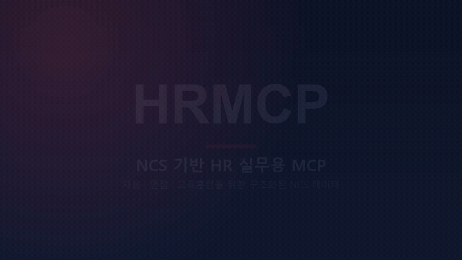](https://github.com/koul777/HRMCP/raw/main/docs/hrmcp_promo.mp4)

**🎬 [고화질 영상(MP4)으로 보기](https://github.com/koul777/HRMCP/raw/main/docs/hrmcp_promo.mp4)** — 위 미리보기를 클릭하면 재생됩니다

</div>

---

# HRMCP — NCS 기반 HR 실무용 MCP

> **HR 실무에서 NCS를 활용하는 가장 빠른 길.**
> 채용 직무에 맞는 NCS 분류부터 능력단위 → 능력단위요소 → 수행준거 → 지식(K)·기술(S)·태도(A)까지,
> 사람이 일일이 찾아 정리하던 정보를 이제 AI가 구조화된 NCS 데이터베이스에서 직접 조회해 활용합니다.

---

## 🚀 HRMCP를 공개합니다

HR 실무에서 NCS를 활용하려면 생각보다 많은 시간과 손이 필요합니다. 채용 직무에 적합한 NCS
분류를 찾고, **능력단위 → 능력단위요소 → 수행준거 → 지식(K)·기술(S)·태도(A)** 를 하나씩 확인한
뒤 다시 정리해야 하기 때문입니다.

HRMCP는 이러한 NCS 데이터를 구조화해, ChatGPT가 필요한 정보를 직접 조회하고 HR 업무에
활용할 수 있도록 만든 **HR 실무용 MCP** 입니다. 쉽게 말하면, 사람이 NCS 사이트에서 일일이
찾고 정리하던 정보를 이제는 AI가 **구조화된 NCS 데이터베이스**에서 직접 찾아 활용할 수 있도록
만든 것입니다.

> 이름 안내: "HRMCP"는 제품/표시 이름이자 MCP 연결 라벨입니다. 내부 파이썬 식별자
> (`ncs_mcp` 패키지, `ncs_*` 도구 이름)는 호환성을 위해 그대로 유지됩니다.

---

## 🧱 핵심은 데이터 전처리입니다

이번 공개까지 약 한 달 동안 NCS 원천 데이터를 정리하고 전처리했습니다. 현재 배포 데이터
기준으로 아래 규모의 데이터를 서로 연결해 **AI가 조회할 수 있는 관계형 구조**로 재구성했습니다.

| 구분 | 규모 |
| --- | --- |
| 능력단위 | **13,435개** |
| 능력단위요소 | **47,620개** |
| 수행준거 | **196,658개** |
| 지식·기술·태도(KSA) | **57만 건 이상** |

공개 서버에는 이 핵심 전처리 결과를 유지한 **경량화 DB**가 탑재돼 있습니다. 일부 직무나
데이터를 샘플로 넣은 것이 아니라, **직무기술서·면접·교육훈련 설계에 필요한 핵심 NCS 데이터는
그대로 유지**하고, 공개 서비스에 불필요한 확장·운영 테이블만 덜어냈습니다.

사용자는 **HTTPS 주소 하나만 연결**하면 되지만, 그 뒤에서는 한 달 동안 구조화한 NCS 데이터가
AI의 검색과 결과물 작성을 뒷받침합니다.

---

## 💡 HRMCP로 할 수 있는 일

- **구조화된 면접 질문 설계** — 채용공고와 직무기술서를 바탕으로 행동면접 질문, 추가 질문,
  평가요소를 설계할 수 있습니다.
- **NCS 기반 직무기술서 작성** — 채용 직무에 적합한 NCS 분류와 능력단위를 찾아 직무기술서를
  작성할 수 있습니다.
- **교육훈련 계획 수립** — 직무별 지식·기술·태도를 분석해 교육과정, 학습목표, 교육내용을
  설계할 수 있습니다.

> ℹ️ HRMCP의 결과물은 **교육·업무 설계를 돕는 참고 자료**이며, 공식 자격·채용·법적·규정 판단을
> 대체하지 않습니다.

---

## 🔧 사용 방법 (ChatGPT 연결)

> 아래 이미지는 ChatGPT Pro 화면 기준입니다. 예시 화면에서는 플러그인 이름을 `rmcp`로
> 만들었지만, 이름은 **HRMCP** 또는 본인이 사용하기 편한 이름으로 지정하면 됩니다.

### 1️⃣ 왼쪽 아래 프로필을 클릭합니다

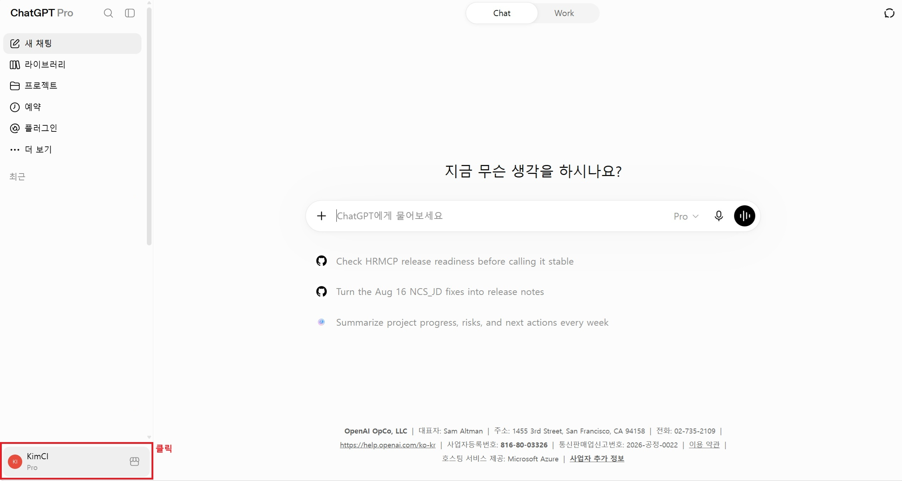

### 2️⃣ 메뉴에서 설정으로 이동합니다

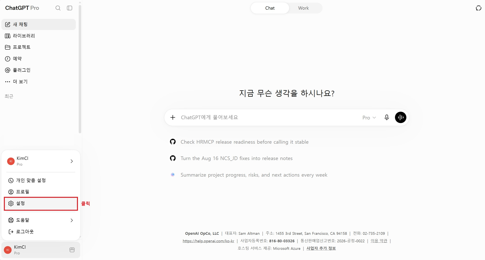

### 3️⃣ 설정 → 플러그인으로 이동한 뒤, 목록을 아래로 내립니다

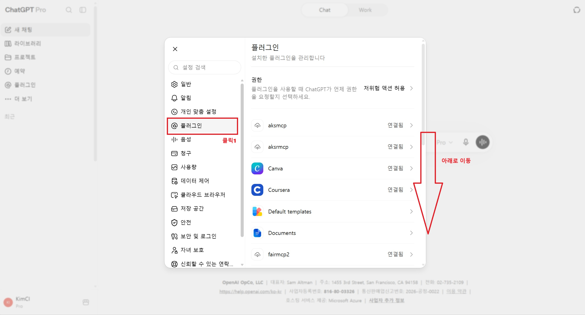

### 4️⃣ 목록 맨 아래의 개발자 모드를 클릭합니다

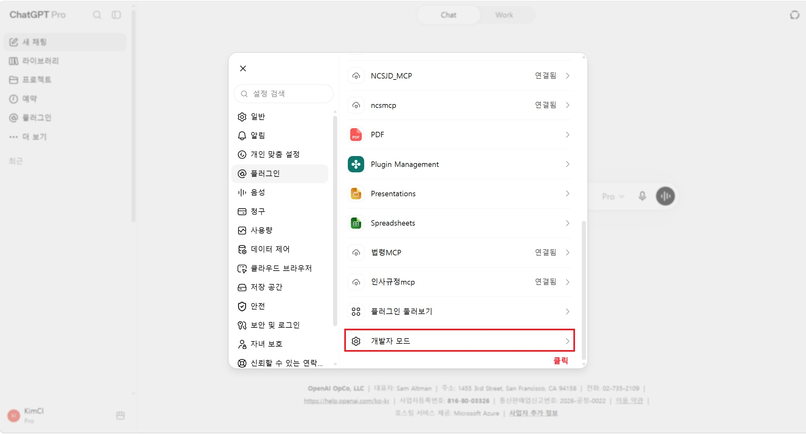

### 5️⃣ 개발자 모드를 ON으로 변경합니다

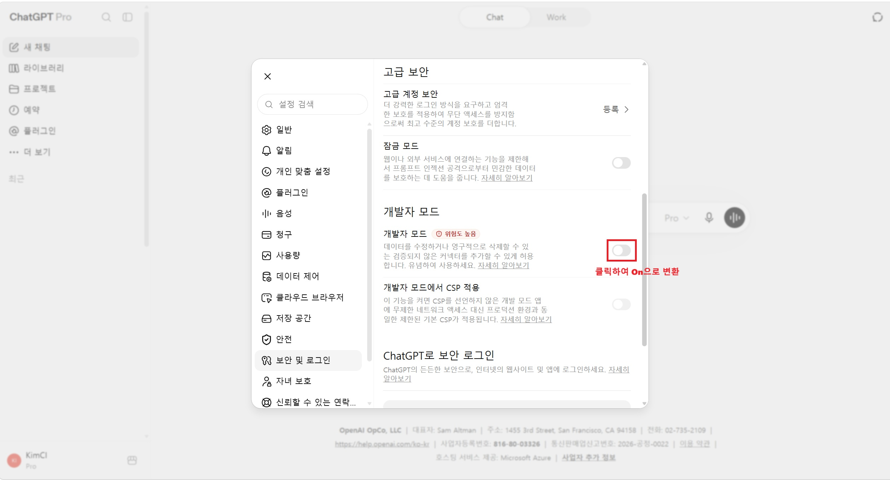

### 6️⃣ 왼쪽 메뉴에서 플러그인을 선택합니다

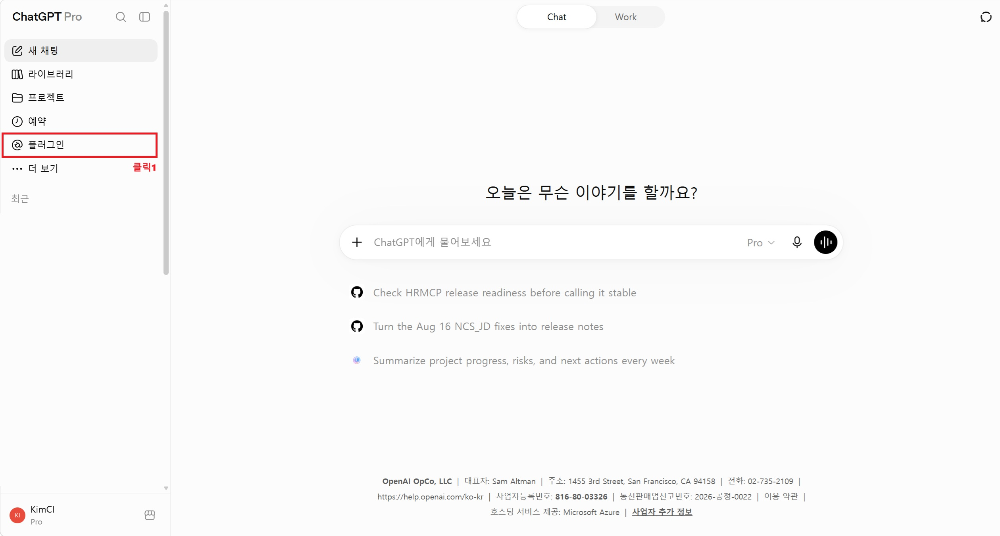

### 7️⃣ 오른쪽 위의 `+` 버튼을 클릭합니다

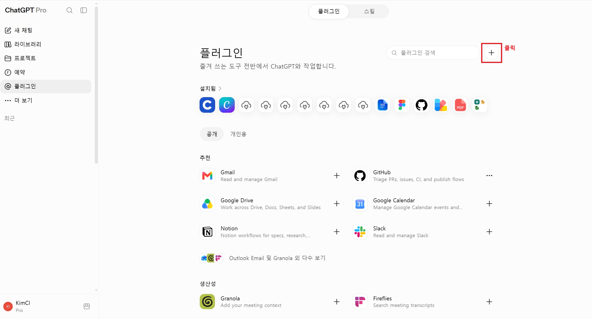

### 8️⃣ 새 플러그인 정보를 입력합니다

- **이름:** `HRMCP` 또는 본인이 사용하기 편한 이름
- **연결 방식:** `서버 URL`
  - **서버 URL:** 아래 HTTPS MCP 주소를 그대로 복사해 붙여넣기

    ```text
    https://ncs-mcp-bridge-mini2.vercel.app/api/mcp
    ```

- **인증 방식:** `인증 없음` 선택 (드롭다운의 `∨`를 클릭해 선택)

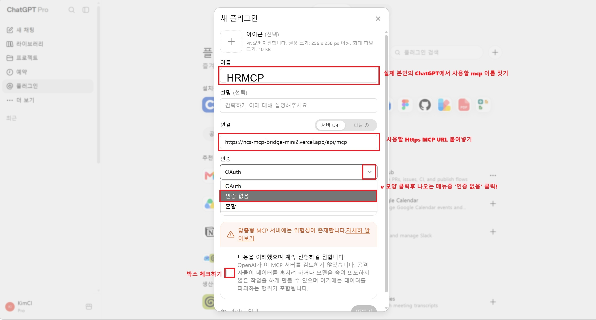

### 9️⃣ 안내사항 확인란에 체크한 뒤 만들기를 클릭합니다

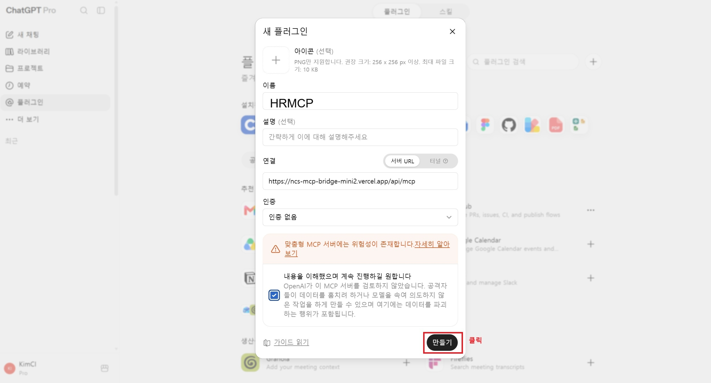

### 🔟 연결하기를 누르면 설정이 완료됩니다

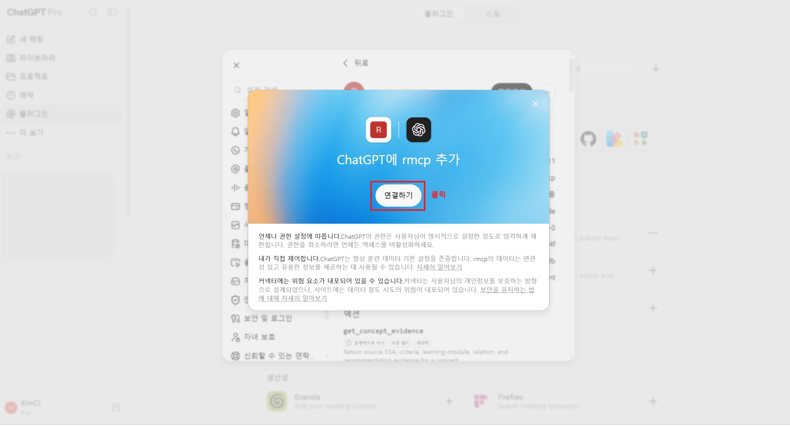

---

## 💬 사용 예시

연결 후 채팅창에서 등록한 이름 앞에 `@`를 붙여 선택하면 됩니다. 예를 들어 플러그인 이름을
`HRMCP`로 만들었다면 `@HRMCP`와 같이 사용합니다.

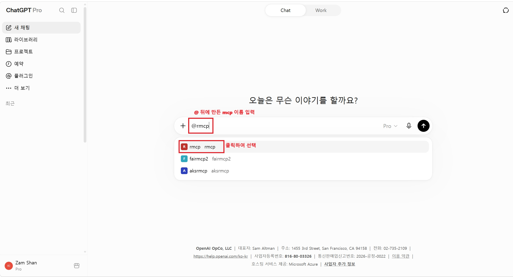

**① 구조화된 면접 질문 만들기**

```text
@HRMCP 첨부한 채용공고와 직무기술서를 참고해 구조화된 행동면접 질문 10개를 작성해줘.
각 질문별 평가요소, 추가 질문, 긍정·부정 행동지표도 함께 제시해줘.
```

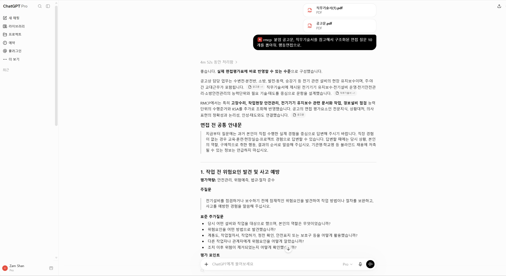

**② 직무기술서 작성하기**

```text
@HRMCP 채용 직무에 적합한 NCS 분류와 능력단위를 찾아 NCS 기반 직무기술서를 작성해줘.
```

**③ 교육훈련 계획 수립하기**

```text
@HRMCP 인사 직무의 능력단위와 지식·기술·태도를 분석해 교육훈련 계획과 과정별 학습목표를 설계해줘.
```

---

## ⚠️ 이용 시 주의사항 (공개 테스트 단계)

현재 HRMCP는 **공개 테스트 단계**입니다.

- **개인정보, 지원자 정보, 기관 내부자료, 비공개 문서** 등 민감한 정보는 제외하고 사용해 주세요.
- 결과물은 참고용이며, 공식 자격·채용·법적·규정 판단의 근거로 사용하지 마세요.
- 서비스 안정성 및 데이터는 예고 없이 변경될 수 있습니다.

---

## 🧩 연결 정보 요약

| 항목 | 값 |
| --- | --- |
| MCP 서버 URL | `https://ncs-mcp-bridge-mini2.vercel.app/api/mcp` |
| 인증 | 없음 (Auth: None) |
| 상태 확인(health) | `https://ncs-mcp-bridge-mini2.vercel.app/api/health` |
| 준비 확인(ready) | `https://ncs-mcp-bridge-mini2.vercel.app/api/ready` |

ChatGPT Custom GPT(Agent/Tools) 설정에서는 아래 JSON의 `url`만 넣으면 됩니다.

```json
{
  "mcpServers": {
    "hrmcp": {
      "url": "https://ncs-mcp-bridge-mini2.vercel.app/api/mcp"
    }
  }
}
```

---

## 🗂️ HRMCP가 하는 일 (기술 개요)

- NCS 계층 구조(분류·능력단위·능력단위요소·수행준거)와 원천 KSA 행을 원본 그대로 보존합니다.
- 원천 KSA 텍스트를 덮어쓰지 않고 KSA/과업 온톨로지 테이블을 구축합니다.
- 교육과정의 목표·시간·방법·시설과 NCS 단위 근거를 과업/KSA 추천 근거에 연결합니다.
- 경력 전환 및 과업 기반 교육훈련 추천을 간결한 근거 요약과 함께 제공합니다.
- NCS 경력경로, 자격항목 API, 직무기초능력 API에서 보조 근거를 추가합니다.
- NCS 구조 검색, 온톨로지 조회, 교육과정 검색, AI-HR 교육경로 설계를 위한 MCP 도구를 노출합니다.
- 자연어 요청을 공개 도구로 라우팅하고 운영자 워크플로를 차단하는 읽기 전용 기관 챗봇
  참고 UI/API를 별도로 포함합니다.

> 현재 제품 범위는 NCS 중심입니다. SQF 및 NCS 학습모듈 플로우는 과거 테이블이나 호환성
> 코드에 남아 있을 수 있으나, 운영자가 명시적으로 다시 활성화하지 않는 한 레거시/참고
> 영역입니다.

### 데이터 흐름

```text
NCS Excel/원천 데이터
  → 분류(classifications)
  → 능력단위(competency_units)
  → 능력단위요소(competency_elements)
  → 수행준거(performance_criteria)
  → 원천 KSA 행(raw KSA)
  → KSA/과업 온톨로지 → 추천 근거(recommendation evidence)
```

---

## 🖥️ 셀프 호스팅 / 배포 (관리자용)

### 로컬 실행 (읽기 전용 기본값)

로컬 런처는 기본적으로 읽기 전용 SQLite 서빙으로 동작하며 운영자 MCP 도구를 감춥니다.

```powershell
.\run_ncs_mcp_http.cmd     # 로컬 HTTP MCP 서버
.\run_ncs_institutional_chat.cmd   # 기관 챗봇 참고 UI/API
```

- 로컬 HTTP: `http://127.0.0.1:8766/mcp` / health `http://127.0.0.1:8766/health`
- 참고 챗 UI: `http://127.0.0.1:8780/`

기본적으로 루프백 외 바인딩은 거부됩니다. 강화된 컨테이너 예시는
`deploy/compose.internal.yml`에 있으며, 신원·TLS·사용자 권한은 기관 게이트웨이
(`docs/INSTITUTIONAL_CHATBOT_SELF_HOST_GUIDE.md`)에서 처리해야 합니다.

### Vercel 배포 (Streamable HTTP)

ChatGPT 연결은 주소 한 줄(`/api/mcp`)만 넣으면 됩니다. 전체 배포 가이드는
`docs/README_VERCEL_HTTPS.md`를 참고하세요.

- `vercel.json`이 함수 진입점(`api/index.py`)을 정의합니다.
- `api/mcp.py`가 `ncs_mcp.server`의 `app`(ASGI)을 export하고 서빙 DB를 부트스트랩합니다.
- 서빙 DB(약 117MB)는 **커밋되지 않으며**, GitHub Release 자산으로 배포되어 런타임에
  `NCS_DB_URL`로 다운로드됩니다.
  - 릴리스: <https://github.com/koul777/HRMCP/releases/tag/ncs-serving-2026-02>

Vercel 환경변수 (아래 중 `NCS_DB_URL` 외에는 `vercel.json`에 이미 포함):

```text
NCS_MCP_READ_ONLY=1
NCS_MCP_ENABLE_OPERATOR_TOOLS=0
NCS_MCP_DISABLE_DNS_REBINDING_PROTECTION=1
NCS_MCP_STREAMABLE_HTTP_PATH=/mcp
NCS_MCP_MAX_CONCURRENT_RECOMMENDATIONS=2
NCS_DB_PATH=/tmp/ncs_interview_serving.db
NCS_DB_URL=https://github.com/koul777/HRMCP/releases/download/ncs-serving-2026-02/ncs_interview_serving_release.db
```

```powershell
vercel env add NCS_DB_URL production   # Release 자산 URL 붙여넣기
vercel deploy --prod
```

### API 키 발급

NCS API 키는 이 저장소 외부에서 발급합니다. 공공데이터포털(HRDK/NCS API 호스팅)에서 필요한
서비스에 접근을 신청하고, 발급된 서비스 키를 로컬 `.env`에 넣습니다.

- `NCS_SERVICE_KEY` — NCS 참조 API 키
- `NCS_TRAINING_COURSE_SERVICE_KEY` — NCS 교육과정 API 키
- `NCS_QUALIFICATION_SERVICE_KEY` — NCS 단위 자격항목 API 키
- `NCS_JOB_BASE_SERVICE_KEY` — NCS 직무기초능력 API 키

> `.env`는 커밋하지 마세요. 실제 키를 보고서·로그·이슈·스크린샷에 붙여넣지 마세요.

---

## 📄 라이선스 및 면책

HRMCP의 추천·생성 결과는 교육·업무 설계를 돕는 참고 자료이며, 공식 자격·라이선스·채용·법적·규정
판단이 아닙니다. NCS 원천 데이터의 권리는 원 저작권자(한국산업인력공단 등)에 있습니다.
