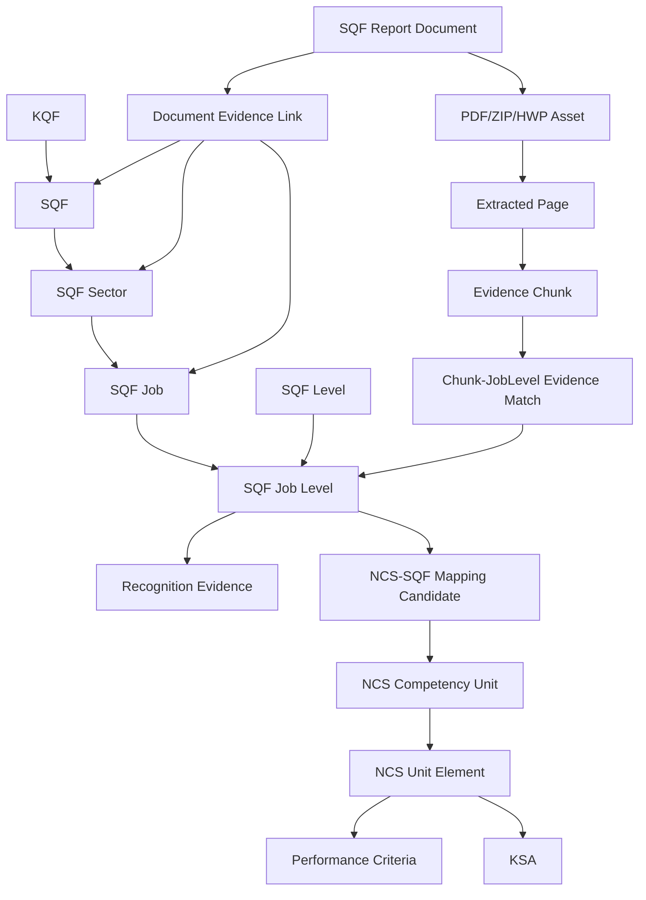

# SQF SQLite Ontology System

This layer turns SQF API rows and SQF library reports into a SQLite-backed ontology source.

## Pipeline

```text
SQF /openapi26 API
  -> sqf_duties
  -> sqf_industry_sectors
  -> sqf_jobs_normalized
  -> sqf_levels
  -> sqf_job_levels_normalized
  -> sqf_recognition_evidence

SQF library list/download endpoint
  -> sqf_library_posts
  -> sqf_library_files
  -> sqf_document_sources
  -> sqf_document_assets
  -> sqf_document_pages
  -> sqf_document_chunks
  -> sqf_chunk_job_level_matches
  -> sqf_document_evidence_links

NCS Excel/API
  -> competency_units / elements / criteria / ksa
  -> sqf_ncs_matches
```

## Ontology Shape



## Core Tables

- `sqf_framework_concepts`: KQF, SQF, Sector, SQF Job, SQF Level, Job Level, Job Competency, Recognition Requirement.
- `sqf_industry_sectors`: SQF industry/sector nodes derived from API fields.
- `sqf_jobs_normalized`: SQF job nodes within sectors.
- `sqf_levels`: SQF level nodes.
- `sqf_job_levels_normalized`: job-level nodes, the practical HR/recommendation unit.
- `sqf_recognition_evidence`: degree, training, qualification, career, license, remark evidence from SQF API.
- `sqf_document_assets`: downloaded PDF/HWP files and ZIP-internal extracted files.
- `sqf_document_pages`: page-level extracted text.
- `sqf_document_chunks`: RAG/MCP evidence chunks with keyword and ontology tags.
- `sqf_chunk_job_level_matches`: candidate evidence links from extracted chunks to SQF job-level nodes.
- `sqf_document_evidence_links`: document-to-concept/sector/job evidence links.

## Commands

```powershell
python scripts\ncs_harness.py collect-sqf-library --download --timeout 60
python scripts\ncs_harness.py build-sqf-sqlite-model
python scripts\ncs_harness.py preprocess-sqf-documents --chunk-chars 2400 --overlap-chars 250 --ocr-empty
python scripts\ncs_harness.py build-sqf-precision-matches --min-score 9 --max-matches-per-chunk 8
python scripts\ncs_harness.py build-sqf-mappings --all-sqf --duty-limit 5000 --limit-per-duty 10
python scripts\ncs_harness.py build-sqf-sqlite-model --summary
```

Use `--only-unprocessed` for incremental document extraction and `build-sqf-precision-matches --asset-id <id>` for incremental chunk evidence matching.

## MCP Tools

- `get_sqf_ontology_summary`
- `search_sqf_document_chunks`
- `search_sqf_precision_matches`
- `get_sqf_ontology_job_level`
- `search_sqf_jobs`
- `get_sqf_job_level`
- `recommend_education_for_duty`
- `analyze_gap`

Important: this ontology supports evidence-based recommendation and gap analysis. It is not an official recognition or qualification decision engine.
